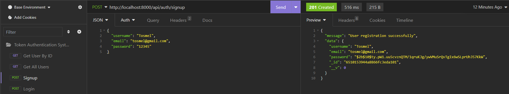
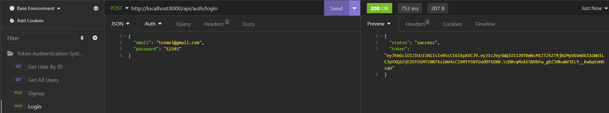
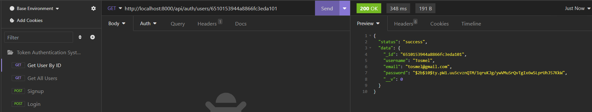
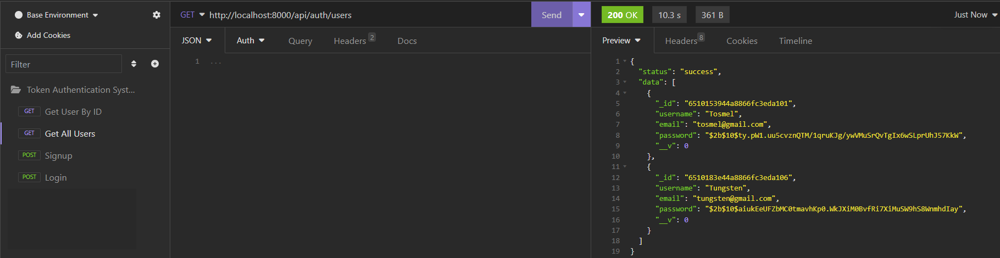

## Token Authentication System

### Objective: 
Create a token authentication system with properly documented code. This system should have at least two endpoints: one for GET endpoints and one for POST endpoints. Each endpoint should require authentication using a token provided by the user.

### Requirements:
<strong>Authentication Flow:</strong>
1. Users should be able to obtain an authentication token, possibly by sending their username and password or other means of identification.
Users should then include this token in the request header when making requests to either the POST or GET endpoints.
2. Endpoint Functionality: Implement two endpoints:

GET endpoint
POST endpoint
Both endpoints should perform specific operations and return a response.
3. Proper Response Handling:

Ensure that each response returned has an appropriate HTTP response code.
Implement validation for user inputs and data received.
Proper response objects (e.g., validation messages, status codes, etc.) must be returned for all endpoints.
4. Error Handling:

Implement try-catch blocks to handle exceptions gracefully.
Your code must not break, and it should return meaningful error responses.

### Basic Work Through

#### <strong>Codebase Setup</strong>
1. Set up your development environment: 
    Ensure you have Node.js installed on your system. You can download it from the official website if you haven't already.
2. Create a new directory for your project and navigate to it in your terminal as `mkdir token_auth_system` and `cd token_auth_system` .
3. Initialize a new Node.js project and install Express and other dependencies: 
<code>
    `npm init -y`  
    `npm install express body-parser dotenv mongoose jsonwebtoken cors mongoose` 
    alternative, run `npm install` to install Express and other dependencies
</code>

  And optional Dev dependency nodemon for development to automatically restart the node application when file changes in the directory are detected 
  `npm install --save-dev nodemon`
4. Create a JavaScript file (e.g., app.js) for your Express application.
5. Write the code for your Express application in app.js: 
- Save the app.js file.
- Run your Express application: 
`node app.js`   or `nodemon app.js`
6. Create a model folder for your Express application e.g. User.js
- Write the schema for your Express application
7. Create a .env file and include your MONGODB URI e.g. 
- MONGODB_URI = 'mongodb+srv://<MONGODB_USERNAME>:<MONGODB_PASSWORD>@project_name.aohcpma.mongodb.net/?retryWrites=true&w=majority'
8. Save the app.js file.
- Run your Express application: 
`node app.js`
9. Perform testing on all your endpoints using postman or Insomnia as shown in the following screenshort example

### Screenshots Guide for Testing on Insomnia
Testing the SIGNUP endpoint Operation on Insomnia

Testing the LOGIN endpoint Operation on Insomnia

Testing the GET USER BY ID endpoint Operation on Insomnia

Testing the GET USER BY ID endpoint Operation on Insomnia

